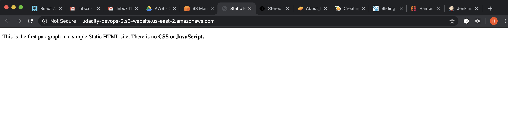
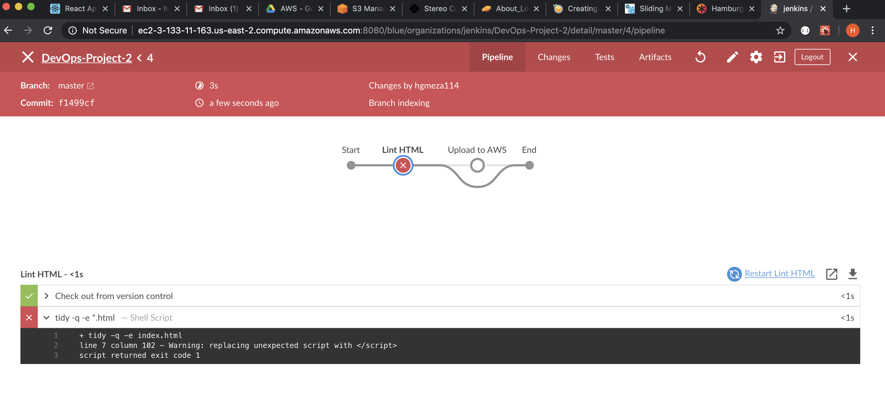

# DevOps-Project-2
Jenkins running on a EC2 instance setup project.

The following images describe the processes made in order to get Jenkins running on an EC2 instance.

## Creating IAM User with Minimum Security
Creating a user with S3, EC2, and VPC access

## Creating an EC2 Instance (Proof that EC2 is running)
Starting an EC2 with SSH access, and available for public on port 8080

## Connecting to EC2 through SSH, and Install Jenkins
Commands ran:
- `wget -q -O - https://pkg.jenkins.io/debian/jenkins.io.key | sudo apt-key add -`
- `sudo sh -c 'echo deb http://pkg.jenkins.io/debian-stable binary/ > /etc/apt/sources.list.d/jenkins.list'`
- `sudo apt-get update`
- `sudo apt-get install jenkins`
- `sudo systemctl status jenkins`

And below the result

## Proof that Jenkins is running on EC2

## Creating a new Jenkins user and Blue Ocean intall
Note that on the left side there is a tab called "Blue Ocean", meaning its successful installation

## Creating a Pipeline
Jenkins is able to identify changes in this repo

## Deploying Project to S3
Jenkins configuration allowing to deploy successful CI to an S3 Bucket. Proof that deployment was successful, after configuring S3 to allow static website hosting and IAM permissions

## Installing Linting
Installed `tidy` linting to allow CD only when HTML file has correct syntax. The initial HTML purposely had a syntax error, hence failing the CD

Install tidy:
- `sudo apt-get install -y tidy`

And the image below shows that after fixing the HTML file, deployment is successful.
